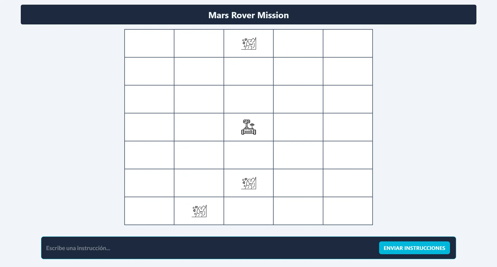

# Prueba Técnica Housfy - Mars Rover



## Descripción
Prueba técnica del `Mars Rover mission` para Housfy, programada por Alejandro Esquivel.
La aplicación simula un rover navegando por un terreno marciano basado en una cuadrícula mientras evita obstáculos.

## Características
- Visualización del terreno en cuadrícula
- Movimiento del rover con rotación (Norte, Sur, Este, Oeste)
- Detección y evasión de obstáculos
- Sistema de entrada de comandos (comandos F, L, R)
- Bordes de cuadrícula envolventes
- Feedback visual de la posición y dirección del rover
- Alertas en tiempo real de obstáculos

## Comandos
- **F**: Mover hacia adelante una posición en la dirección actual
- **L**: Rotar 90 grados a la izquierda
- **R**: Rotar 90 grados a la derecha

## Configuración del Proyecto
```sh
# Instalar dependencias
npm install

# Compilar y ejecutar servidor de desarrollo
npm run dev

# Compilar para producción
npm run build

# Ejecutar linter
npm run lint
```

## Tecnologías Utilizadas
- Vue 3
- Vite
- Tailwind CSS
- SweetAlert2 para notificaciones
- ESLint + Prettier para formateo de código

## Estructura del Proyecto
```
src/
├── components/
│   ├── MarsRover.vue    # Componente principal
│   ├── RoverGrid.vue    # Visualización de la cuadrícula
│   └── RoverInput.vue   # Entrada de comandos
├── icons/
│   ├── RoverIcon.vue    # Visualización del rover
│   └── ObstacleIcon.vue # Visualización de obstáculos
├── helpers/
│   └── helpers.js       # Funciones de utilidad
└── assets/
    ├── rover.svg
    └── obstacle.svg
```

## Desarrollo
1. El tamaño de la cuadrícula y el número de obstáculos se pueden configurar mediante props
2. El rover comienza en una posición predeterminada (configurable en `RoverGrid.vue`)
3. Los comandos se validan antes de ejecutarse
4. Los obstáculos se colocan aleatoriamente evitando la posición inicial del rover
5. El rover se detiene cuando encuentra un obstáculo


## Requisitos
- Node.js
- npm/yarn